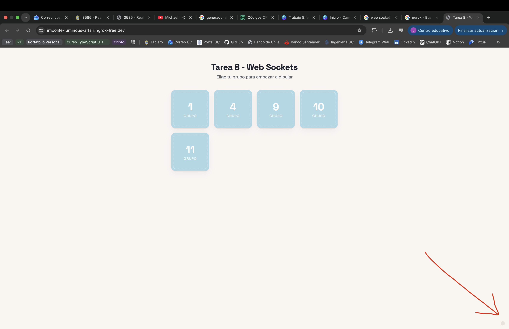

# Competencia de Dibujos en tiempo real

WebSockets con Express y Socket.IO. El frontend fue desarrollado en HTML, CSS y JavaScript Vanilla, sin utilizar frameworks.

El objetivo de la aplicación es facilitar una dinámica interactiva donde distintos grupos dibujan simultáneamente en pizarras independientes mientras un administrador controla el desarrollo de la actividad en tiempo real.

## Tecnologías utilizadas 

* Node.js
* Express
* Socket.IO
* HTML5 Canvas
* JavaScript Vanilla
* CSS

## Cómo correrla

Instalación de dependencias e inicialización del servidor:

```bash
npm install     
npm start      
```

Por defecto queda en `http://localhost:3000`.

Para probar en vivo, exponla con ngrok:

## Para probar la aplicación desde otros dispositivos

Como el servidor se ejecuta localmente, para que otros dispositivos (por ejemplo teléfonos) puedan acceder a la aplicación durante una demostración es necesario exponer el servidor mediante ngrok.

Si no se encuentra instalado, puede descargarse desde: https://ngrok.com/

Una vez configurado, ejecutar:

```bash
ngrok http 3000
```

Ngrok mostrará una salida similar a:

```bash
Forwarding https://impolite-luminous-affair.ngrok-free.dev -> http://localhost:3000
```

La URL HTTPS generada debe compartirse con los participantes. Todos accederán a esa dirección para ingresar al lobby de la aplicación.

Para verificar el correcto funcionamiento basta con abrir dicha URL desde otro dispositivo (idealmente un teléfono) y comprobar que el administrador observa en tiempo real las acciones realizadas.

## Configurar los grupos

Edita el arreglo al principio de **`server.js`**:

```js
const grupos = ["1", "2", "3", "4", "5", "6"];
```

Se puede usar cualquier string como nombre de grupo (`"Rojo"`, `"Equipo A"`, etc.), no solo números.
El lobby, las salas de dibujo y la vista admin se ajustan solos a esta lista — no hay que tocar nada más.


## Cómo se usa

- **Participantes**: entran a la URL principal, ven la lista de grupos, tocan el suyo y dibujan
  (lápiz, paleta de colores + color personalizado, goma, control de grosor).
- **Admin (tú)**: hay un punto gris casi invisible en la esquina inferior derecha del lobby —
  haz click ahí para ir a `/admin.html`. También puedes ir directo a esa URL.
  Desde ahí ves los tableros de todos los grupos en tiempo real y controlas:
  - **Iniciar ronda**: define minutos y arranca la cuenta atrás (se ve en todas las pantallas).
  - **Detener ahora**: corta el dibujo de inmediato, sin esperar a que termine el tiempo.
  - **Reiniciar ronda**: borra todos los tableros y vuelve a habilitar el dibujo.

Cuando el tiempo se acaba (por temporizador o por "Detener ahora"), todos los canvas de cada grupo se bloquean automáticamente y aparece un aviso de "Tiempo terminado" — nadie puede seguir dibujando hasta que reinicies la ronda.

IMPORTANTE: la página de administrador se encuentra escondida, ya que no alcanzamos implementar algún mecanismo de seguridad y así evitamos que el resto de grupos vean los dibujos del resto.



## Uso de IA
Debido a la semana de exámenes usamos bastante la IA como apoyo, especialemente en taeas no relacionadas con el objetivo pri...

- Diseño y estructura de la página HTML + CSS
- Funcionalidades de la app como los timers, el inicio yfin de ronda
- Levantamiento del servidor con express
- Apoyo en redacción de documentación y este readme en particular (se le dió un boceto y redactpó esta versión)

Además se usó como apoyo para comprender e implementar web sockets....


Debido a la carga académica del cierre del semestre, se utilizó exhaustivamente la IA como herramienta de apoyo durante el desarrollo del proyecto, y especialmente en aspectos que no constituían el objetivo principal de la actividad.

Entre los usos realizados se encuentran:

* apoyo en el diseño e implementación de la interfaz HTML y CSS;
* generación de las funcionalidades del servidor Express (server muy básico)
* apoyo en la implementación de componentes auxiliares, como el temporizador de la ronda y la sincronización de ciertos estados
* asistencia en la redacción y mejora de la documentación, incluyendo este README.

Además, la IA fue utilizada como apoyo para comprender el funcionamiento de WebSockets y de Socket.IO, contrastando posteriormente las respuestas con la documentación oficial y adaptando las soluciones al proyecto.

Toda la integracióny validación del código utilizado fue realizada por el equipo.

## Auto Evaluación

Consideramos que la actividad permitió aplicar de manera práctica uno de los temas más interesantes (y unas de las herramientas más poderosas) del curso: la comunicación en tiempo real mediante WebSockets.

El resultado fue una aplicación sencilla pero suficientemente completa para realizar una demostración interactiva y entretenida con todo el curso, permitiendo que múltiples usuarios colaboren simultáneamente sobre distintas pizarras mientras un administrador controla el desarrollo de la actividad.

Como aspectos a mejorar, creemos que una planificación más anticipada habría permitido distribuir mejor las tareas y dedicar más tiempo a incorporar funcionalidades adicionales y refinar algunos detalles de la interfaz. Sin embargo, considerando la etapa del semestre y la carga académica existente, estamos conformes con el resultado obtenido y con los objetivos alcanzados.
